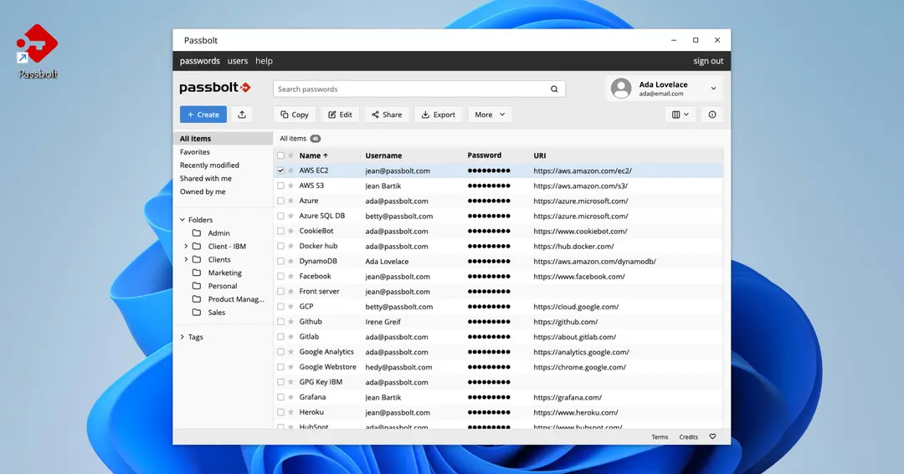
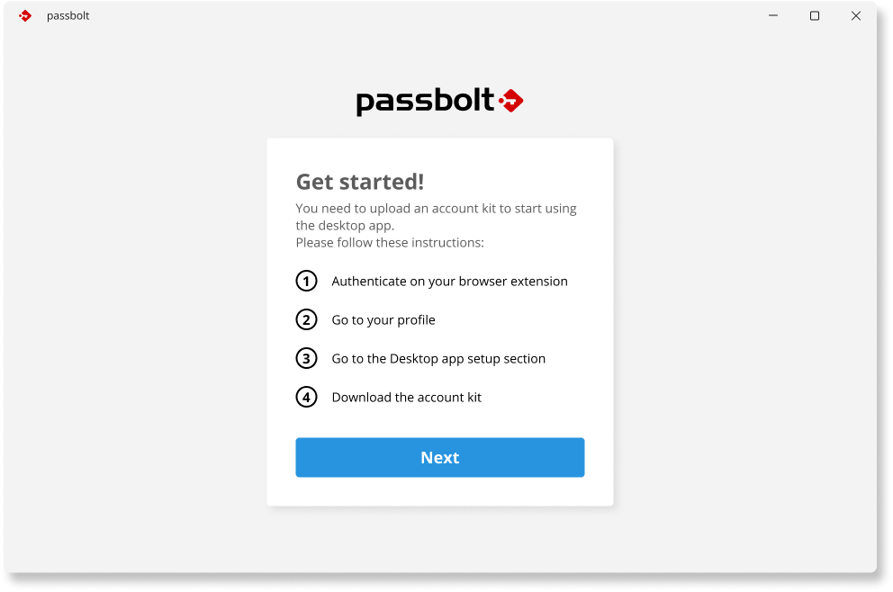

<picture>
  <source media="(prefers-color-scheme: dark)" srcset="https://github.com/passbolt/passbolt_styleguide/blob/master/src/img/logo/logo_white.svg">
  <source media="(prefers-color-scheme: light)" srcset="https://github.com/passbolt/passbolt_styleguide/blob/master/src/img/logo/logo.svg">
  
</picture>
<br>
<br>

The open source password manager for teams.

[](LICENSE.txt)

[](LICENSE.txt)
<br>

# Introducing Passbolt

Passbolt is a security-first, open source password manager for teams. It helps organizations centralize, organize and share passwords and secrets securely.

What makes passbolt different?
- **Security:** Passbolt security model features user-owned secret keys and end-to-end encryption. It is audited multiple times annually, and [findings](https://help.passbolt.com/faq/security/code-review) are made public.
- **Collaboration:** Securely share and audit credentials, with powerful and dependable policies for power users.
- **Privacy:** Passbolt is headquartered in the EU,:european_union: specifically in Luxembourg. Passbolt doesn't collect personal data or telemetry, and can be deployed in an air-gapped environment.

# About the desktop app

Passbolt Desktop App is a UWP (Universal Windows Platform) application that provides a modern and flexible way to manage your passwords securely. With Passbolt Desktop App, you can store your passwords and other sensitive information in a centralized location, and you can access them from any Windows 10 device.

The app is built using the UWP platform and it leverages the power of Webview2 to provide a rich and engaging user interface. With Webview2, Passbolt Desktop App can display web-based content within the app, such as the Passbolt web interface, and it can interact with the content programmatically.

By using UWP and Webview2, Passbolt Desktop App provides a consistent and seamless user experience across all Windows 10 devices. The app can adapt to the device it's running on, providing a user interface that's optimized for the screen size and input method of the device. With Passbolt Desktop App, you can manage your passwords securely, and you can do it in a way that's flexible and convenient for you.

# Get Started

## How to install the Windows app

Access the application by clicking on the button below :

<a href="https://apps.microsoft.com/detail/9PFXS2WVKVPB"></a>

### Debug version alternative

Debug packages are available [here](https://github.com/passbolt/passbolt-windows/releases) for installation. These packages are made to be used only for troubleshooting issues when no other solution is available. Once the issue is found and solved, it is recommanded to go back with the standard version of the application.

In order to proceed with the installation of a debug package, you need:
1. Download the latest passbolt-windows_*_Debug.zip package
2. Unzip the package
3. Install the certificate of the application on your machine. Double-click on the *.cer file you can find in the folder after having unzipped it. The certificate should be place in "Local Machine" > "Trusted Root Certification Authorities"
4. Install the application using the *.msixbundle package from the unzipped folder

The application is now installed on your machine and ready to be launched.

#### Trouble shooting

1. If you have the Passbolt Desktop App already installed on your machine, it is very likely that Windows will not let you install the debug package. You may need to remove the standard version first in order to proceed.
2. The installer opens but, it's not possible to install the package, the button is greyed out. In that case, it could be that the proper certificate is not installed, installed at the wrong place or not trusted. Make sure during the installation that the certificate is placed in "Local Machine" > "Trusted Root Certification Authorities" (the name may vary because of the localization settings of your OS). A restart of your machine can help after the procedure.
3. The debug app starts but the debugger windows do not open. It can happen sometimes. To fix this, ensure that the developer mode is activated on your OS ([How to enable the developer mode on Windows 11](https://learn.microsoft.com/en-us/windows/apps/get-started/enable-your-device-for-development))


## Import an existing passbolt account

After installing the application, you will see instructions on how to download your account kit via the web application. By clicking the ‘Next’ button, you will be guided to the process for uploading your account kit.

<div style="text-align: center;">
  
</div>

Once the account kit is successfully uploaded, your account information, including your username and the URL of the Passbolt server, will be displayed on the screen.

Please review this information carefully before proceeding. Once your passphrase is validated, the setup of your account will be complete, and you will be able to access the password workspace.


# Development

## Requirements
- Visual Studio >= 2019 ([download](https://visualstudio.microsoft.com/downloads/))
- Visual Studio UWP workload
- Edge ([download](https://developer.microsoft.com/en-us/microsoft-edge/webview2/))
- Passbolt API >= v4.2.0

## Clone the project

```bash
git clone git@github.com:passbolt/passbolt-windows
```

## Configure the API

Enable the desktop application support in the API.

If you are running passbolt with docker, set to `true` the environment variable `PASSBOLT_PLUGINS_DESKTOP_ENABLED`

Otherwise, edit your `/etc/passbolt/passbolt.php` to add the following:
```php
return [
  "passbolt" => [
    "plugins" => [
      "desktop" => [
         "enabled" => true
       ]
    ]
  ]
]
```

## Start the application with Visual Studio

Start Visual studio and open the project folder.
Click to the start button in the top menu, et voilà.

## Trouble shooting
- I have started the application, visual studio failed when calling API.
 In case you the API is using a self signed certificate, you need Windows to trust it. Checkout this [documentation](https://learn.microsoft.com/en-us/skype-sdk/sdn/articles/installing-the-trusted-root-certificate).

## Running tests

### Running tests with Visual code

Passbolt Desktop App includes a suite of unit tests to ensure that the app functions correctly. To run the unit tests, follow these steps:

1. Open the solution in Visual Studio.
2. In the Solution Explorer, right-click on the `PassboltDesktopApp.UnitTests` project and select "Run Tests".
3. The unit tests will run, and the results will be displayed in the Test Explorer.

### Running tests with command lines

To run the Passbolt Desktop App unit tests using the command line, you can use the dotnet test command. Follow these steps to run the tests using the command line:

1. Open a command prompt and navigate to the project directory.
2. Run the following command to restore the NuGet packages:

``MSBuild /t:Restore``

3. Run the following command to build the solution:

``MSBuild /t:Build /p:Configuration=Release``

4. Run the following command to run the unit tests:

``MSBuild /t:VSTest /p:VSTestPath=<Path to vstest.console.exe> /p:VSTestArguments="/Settings:<Path to appsettings.json> /Logger:trx" /p:Configuration=Release``

This command runs the unit tests in Release mode and generates a test results file named PassboltDesktopApp.UnitTests.trx.

After the tests complete, you can view the results in Visual Studio or any other tool that supports TRX format.

## Checking for Outdated .NET NuGet Dependencies in Visual Studio
1. Open your project in Visual Studio.
2. In the Solution Explorer, right-click on the project and select "Manage NuGet Packages".
3. In the NuGet Package Manager, click on the "Updates" tab to see a list of all available updates for your NuGet packages.
4. You can use this information to determine if any of your NuGet packages need to be updated.
